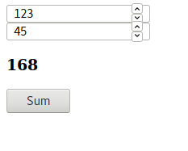
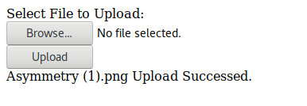
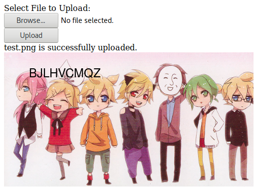

# Express Example
Some Tuts

## Query String Example

- Đề bài: Dùng express để tính tổng 2 số nhập từ input của form và in ra kết quả thông qua nunjucks.

- Logic:
    - Sử dụng `form` để truyền `Query String` thông qua thuộc tính `action` và `method` của `form`
    - Sử dụng `app.get` với `req,res` để bắt `Query String` truyền từ `form`.
    - Tính tổng 2 số nhập từ `input` của `form`,tính toán bằng cách dùng `req` bắt `Query String` truyền từ `form` rồi `render` lại trang html với `nunjucks`.

- .views/QueryStringExample.html

```html
<!--truyền thuộc tính action và method cho form-->
<form action="/form" method="GET">
    <!--sử dụng nunjucks truyền vào value của input-->
    <div><input type="number" name="num1" value="{{a}}"> </div>
    <!--sử dụng nunjucks truyền vào value của input-->
    <div><input type="number" name="num2" value="{{b}}"></div>
    <!--sử dụng nunjucks truyền vào value sum-->
    <div> <h3>{{sum}}</h3></div>
    <!--truyền thuộc tính submit cho button để đẩy value lên url-->
    <div><button type="submit">Sum</button></div>
</form>
```

- ./QueeryStringExample.js
```javascript
const express = require('express')
const app = express()
const nunjucks = require('nunjucks')
const bodyParser = require('body-parser')

// cấu hình nunjucks 
nunjucks.configure('./views', {
    noCache: true,
    express: app,
    autoescape: true,
    watch: true
})

// sử dụng midle-ware bodyParser
app.use(bodyParser.urlencoded({
    extended: true
}))

// cấu hình '/'
app.get('/', (req, res) => {
    res.render('QueryStringExample.html')
})

// cấu hình '/form'
app.get('/form', (req, res) => {
    // sau dấu '?' thì dùng req.query đối với thẻ form
    let a = parseInt(req.query.num1) // lấy ra num1=a ở url
    let b = parseInt(req.query.num2) // lấy ra num2=b ở url
    let sum = a + b // tính tổng
    // render lại với nunjucks
    res.render('QueryStringExample.html', {
        a: a, // truyền value của a sang views
        b: b, // tương tự
        sum: sum //
    })
})

app.listen(3000, ()=>{
    console.log('Server listening on port 3000')
})
```

- Kết quả:



## Upload with Multer
- Đề bài: Tạo một trang upload với các chức năng sau:
  - Cho phép upload file ảnh từ form.
  - Sau khi upload thì sửa ảnh (thêm text) và load ảnh đó
- Logic:
  - Tạo form với enctype là multipart/form-data để có thể upload nhiều loại file.
  - Sử dụng `express.static` và `nunjucks`  để có thể load ảnh từ folder public vào trang `html`.
  - Sử dụng `multer` để upload ảnh.
  - Sử dụng `gm` để chỉnh sửa ảnh.
  - Do `multer` và `gm` chạy đồng bộ với nhau nên gặp tình trạng load ảnh không đúng và đang load thì khựng,... nên ta sẽ dùng `promise,async,await` để `multer` và `gm` chạy bất đồng bộ aka tuần tự.

- ./views/Upload.html:
```html
    <!-- Khởi tạo form với các thuộc tính:-->
    <!-- action sang trang /upload-->
    <!-- method = post-->
    <!-- enctype = multipart/form-->
    <form action="/upload" method="post" enctype="multipart/form-data">
    	<div><span>Select File to Upload:</span></div>
        <div><input type="file" name="img"></div>
        <div><button type="submit"  class="button">Upload</button></div>
        <!--Truyền thuộc tính 'mesage' của nunjucks-->
        <div><span>{{message}}</span></div>
    </form>
```

- Upload.js:
```javascript
const express = require('express')
const multer = require('multer')
const nunjucks = require('nunjucks')
const bodyParser = require('body-parser')
const shortid = require('shortid')

const app = express()

// -----Sử dụng midle-ware ---
app.use(bodyParser.urlencoded({
    extended: true
}))
app.use(express.static('public'))
//-----------------------------

// -----Cấu hình nunjucks------
nunjucks.configure('./views', {
    noCache: true,
    autoescape: true,
    express: app,
    watch: true
})

app.engine('html', nunjucks.render)
app.set('view engine', 'html')
//-----------------------------


//-------routing trang '/'-----
app.get('/', (req, res) => {
    res.render('Upload.html')
})
//-----------------------------

//----routing trang '/upload'-----
// Tạo id cho ảnh
let id = shortid.generate()
// Khởi tạo các thuộc tính của multer gán cho biến upload
const upload = multer({
    //cấu hình engine diskStorage gán cho thuộc tính stogare
    storage: multer.diskStorage({
        destination: (req, file, cb) => {
            //nơi chứa file upload
            cb(null, './public/uploads/')
        },
        filename: (req, file, cb) => {
            // Tạo tên file mới cho file vừa upload
            cb(null, id + '-' + file.originalname)
        }
    }),
    //cấu hình hàm phân loại file upload
    fileFilter: (req, file, cb) => {
        if (file.mimetype === 'image/png' || file.mimetype === 'image/jpg' || file.mimetype === 'image/jpeg') {
            // nếu file là image thì upload file.
            cb(null, true)
        } else {
            // nếu không phải thì bỏ qua phần upload
            cb(null, false)
        }
    }
})

// require các module để sửa ảnh
const fs = require('fs')
const gm = require('gm').subClass({ imageMagick: true })
// hàm sửa ảnh
const editImage = (req) => { // truyền vào req của app.post
    return new Promise((resolve, reject) => { // trả về 1 promise
        // khai báo tới file ảnh vửa upload
        let filePath = req.file.destination + req.file.filename
        // bắt đầu sửa ảnh
        gm(filePath)
            .font("Helvetica.ttf", 24) //font text
            .drawText(50, 50, id) // tọa độ của text và nội dung là id
            .write(filePath, (err) => { //chép đè lên ảnh cũ
                if (err) { console.log(err) }
                else { console.log('Done'); }
                resolve() // sau khi xong thì resolve 
            })
    });
}
// hàm render ảnh đã được sửa
const renderEditedImage = (req, res) => { //truyền vào req,res của app.post
    return new Promise((resolve, reject) => { //trả về một promise
        res.render('Upload.html', { //render lại trang với mes và img bằng nunjucks 
            message: `${req.file.originalname} is successfully uploaded.`,
            img: `uploads/${req.file.filename}`
        }, resolve()) // sau khi xong thì resolve 
    });
}

// sử dụng promise,async,await để upload,sửa và view file đơn
app.post('/upload', upload.single('img'), async (req, res, next) => {
    // Bắt đầu upload
    // Nếu file không tồn tại hoặc bỏ qua lúc fileFilter thì render lại trang với message mới
    if (!req.file) {
        res.render('Upload.html', {
            message: "no file to upload or file type is not supported"
        })
    } else { 
    // nếu file qua được fileFilter thì upload và show ảnh thông qua nunjucjs render
        // await một promise cho tới khi nó resolve 
        await editImage(req) // truyền vào req của upload
        await renderEditedImage(req, res) //truyền vào req và res của upload
    }
})
//----------------------------------


//--Khởi tạo server trên port 3000--
app.listen(3000, () => {
    console.log('app listening in port 3000')
})
//----------------------------------
```
- Kết quả:
  - Fail:  


  - Successed (Khi chưa sửa và up ảnh đã sửa):  



  - Completed (Sửa và up ảnh vừa sửa):  

