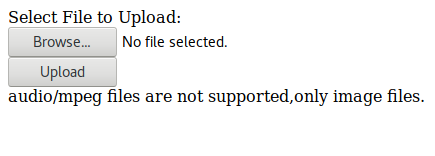

# Express Example
Some Tuts

## Query String Example
- .views/QueryStringExample.html

```html
<!--truyền thuộc tính action và method cho form-->
<form action="/form" method="GET">
    <!--sử dụng nunjucks truyền vào value của input-->
    <div><input type="number" name="num1" value="{{a}}"> </div>
    <!--sử dụng nunjucks truyền vào value của input-->
    <div><input type="number" name="num2" value="{{b}}"></div>
    <!--sử dụng nunjucks truyền vào value sum-->
    <div> <h3>{{sum}}</h3></div>
    <!--truyền thuộc tính submit cho button để đẩy value lên url-->
    <div><button type="submit">Sum</button></div>
</form>
```

- ./QueeryStringExample.js
```javascript
const express = require('express')
const app = express()
const nunjucks = require('nunjucks')
const bodyParser = require('body-parser')

// cấu hình nunjucks 
nunjucks.configure('./views', {
    noCache: true,
    express: app,
    autoescape: true,
    watch: true
})

// sử dụng midle-ware bodyParser
app.use(bodyParser.urlencoded({
    extended: true
}))

// cấu hình '/'
app.get('/', (req, res) => {
    res.render('QueryStringExample.html')
})

// cấu hình '/form'
app.get('/form', (req, res) => {
    // sau dấu '?' thì dùng req.query đối với thẻ form
    let a = parseInt(req.query.num1) // lấy ra num1=a ở url
    let b = parseInt(req.query.num2) // lấy ra num2=b ở url
    let sum = a + b // tính tổng
    // render lại với nunjucks
    res.render('QueryStringExample.html', {
        a: a, // truyền value của a sang views
        b: b, // tương tư
        sum: sum //
    })
})

app.listen(3000, ()=>{
    console.log('Server listening on port 3000')
})
```

- Kết quả:


## Upload with Multer
- ./views/Upload.html:
```html
    <!-- Khởi tạo form với các thuộc tính:-->
    <!-- action sang trang /upload-->
    <!-- method = post-->
    <!-- enctype = multipart/form-->
    <form action="/upload" method="post" enctype="multipart/form-data">
    	<div><span>Select File to Upload:</span></div>
        <div><input type="file" name="img"></div>
        <div><button type="submit"  class="button">Upload</button></div>
        <!--Truyền thuộc tính 'mesage' của nunjucks-->
        <div><span>{{message}}</span></div>
    </form>
```

- Upload.js:
```javascript
const express = require('express')
const multer = require('multer')
const nunjucks = require('nunjucks')
const bodyParser = require('body-parser')
const shortid = require('shortid')

const app = express()

// -----Sử dụng midle-ware ---
app.use(bodyParser.urlencoded({
  extended: true
}))
//-----------------------------

// -----Cấu hình nunjucks------
nunjucks.configure('./views', {
  noCache: true,
  autoescape: true,
  express: app,
  watch: true
})

app.engine('html', nunjucks.render)
app.set('view engine', 'html')
//-----------------------------


//-------routing trang '/'-----
app.get('/', (req, res) => {
  res.render('Upload.html')
})
//-----------------------------

//----routing trang '/upload'-----
app.post('/upload', (req, res) => {
  // Khởi tạo các thuộc tính của multer gán cho biến upload
  const upload = multer({
    //cấu hình engine diskStorage gán cho thuộc tính stogare
    storage: multer.diskStorage({
      destination: (req, file, cb) => {
        //nơi chứa file upload
        cb(null, 'uploads/')
      },
      filename: (req, file, cb) => {
        // Tạo tên file mới cho file vừa upload
        cb(null, shortid.generate() + '-' + file.originalname)
      }
    }),
    //cấu hình hàm phân loại file upload
    fileFilter: (req, file, cb) => {
      //chỉ láy file image
      if (file.mimetype === 'image/png' || file.mimetype === 'image/jpg' || file.mimetype === 'image/jpeg') {
        // nếu file là image thì render lại trang với mes mới và upload file.
        return cb(res.render('Upload.html', {
          message: `${file.originalname} Upload Successed.`
        }), true)
      } else {
        // nếu không phải thì render lại trang với mes mới và bỏ qua phần upload
        return cb(res.render('Upload.html', {
          message: `${file.mimetype} files are not supported,only image files.`
        }), false)
      }
    }
  }).single('img') //upload file đơn

  // Bắt đầu upload
  upload(req, res, (err) => {
    if (err) { //nếu có lỗi thì báo lỗi
      console.log(err)
    }
  })
})
//----------------------------------


//--Khởi tạo server trên port 3000--
app.listen(3000, () => {
  console.log('app listening in port 3000')
})
```
- Kết quả:
  - Fail:  
    
  - Successed:  
    